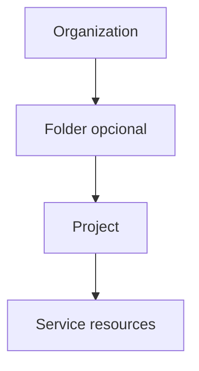
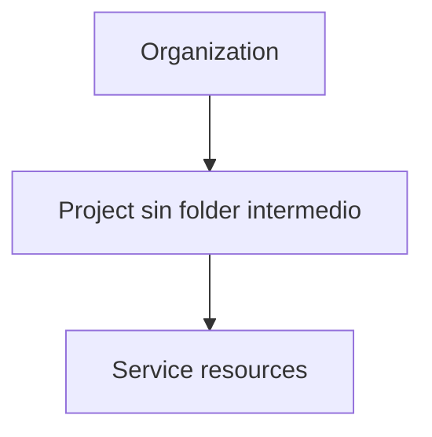
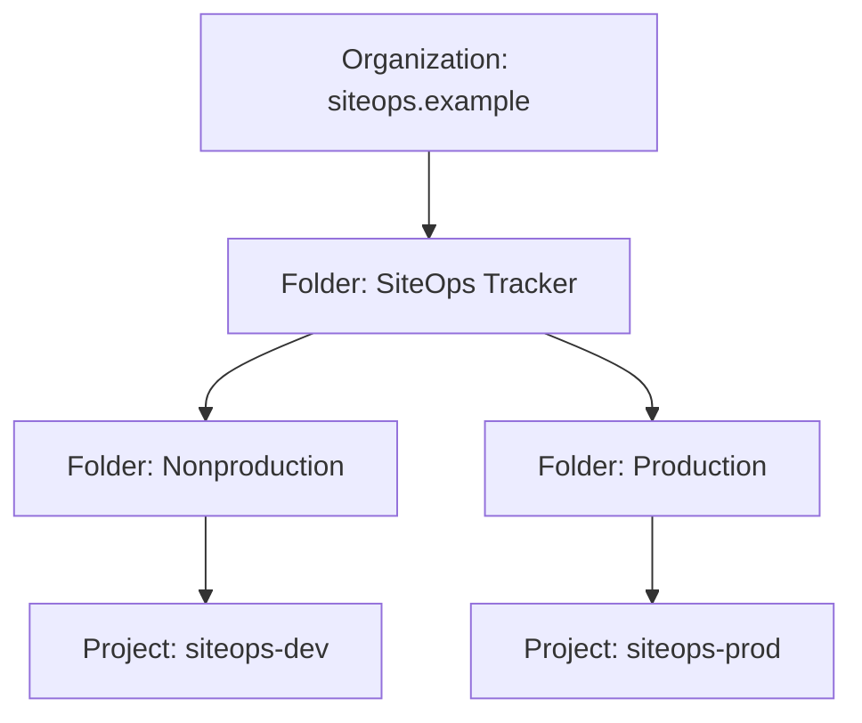
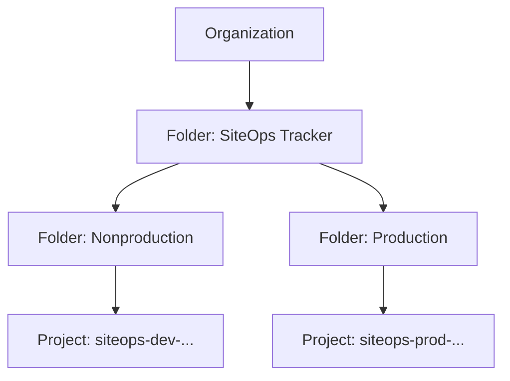

# Google Cloud Associate Cloud Engineer (ACE) 2026

## Lección 06 — Jerarquía: organizaciones, carpetas, proyectos y recursos

**Fecha del plan:** 28 de septiembre de 2026  
**Dominio de la guía oficial:** 1.1 — *Setting up cloud projects and accounts*  
**Punto de la guía:** *Creating a resource hierarchy*  
**Duración sugerida:** 75–90 minutos  
**Proyecto transversal:** **SiteOps Tracker**, proyecto ficticio de portafolio  
**Práctica del día:** diseñar una jerarquía con entornos de desarrollo y producción

> Esta lección enseña la estructura de Resource Manager. Las políticas de organización corresponden a la Lección 07 e IAM a la Lección 08; hoy solo veremos su relación con la jerarquía para entender por qué importa elegir correctamente cada nivel.

---

## 1. Objetivo de aprendizaje

Al terminar la lección podrás:

1. Explicar la relación **Organization → Folder → Project → Service resource**.
2. Distinguir qué elementos son obligatorios y cuáles son opcionales.
3. Diferenciar **project name**, **project ID** y **project number**.
4. Explicar por qué una cuenta de facturación no es un padre dentro de la jerarquía.
5. Diseñar una separación razonada entre desarrollo y producción para SiteOps Tracker.
6. Inspeccionar, sin modificar, las organizaciones, carpetas y proyectos visibles para tu cuenta desde Google Cloud Console y `gcloud`.
7. Resolver escenarios ACE en inglés sobre ubicación, aislamiento, herencia y límites de proyectos.

### Evidencia que debes producir

Completa al final de la práctica:

- un diagrama de la jerarquía propuesta;
- una tabla con el propósito de cada carpeta y proyecto;
- la salida —sin datos sensibles— de los comandos de consulta;
- tres decisiones justificadas;
- la evaluación de 10 preguntas;
- una ficha de errores con cualquier concepto que necesites reforzar.

Recibir el archivo no demuestra dominio. La evidencia y la autoevaluación son las que permiten medir tu progreso.

---

## 2. Prerrequisitos explicados desde cero

### 2.1 Cuenta de Google y acceso a Google Cloud

Necesitas una cuenta que pueda abrir Google Cloud Console. Una cuenta personal puede tener proyectos sin pertenecer a una organización. Para ver una **Organization** y crear **Folders**, normalmente necesitas una identidad administrada mediante Google Workspace o Cloud Identity y los permisos correspondientes.

No ver una organización no impide completar la lección: la ruta conceptual incluida más adelante cubre toda la práctica.

### 2.2 Google Cloud Console y Cloud Shell

- **Google Cloud Console** es la interfaz web.
- **Cloud Shell** es una terminal temporal en el navegador con `gcloud` instalado y autenticado.
- `gcloud` usa una cuenta activa y una configuración activa. Antes de interpretar resultados, debes confirmar ambas.

### 2.3 Diferencia entre jerarquía y ubicación geográfica

La jerarquía responde **quién contiene a quién y dónde se aplican controles administrativos**. Una región o zona responde **dónde se ejecuta o almacena una carga**. Un proyecto puede contener recursos en varias regiones, si el producto y las políticas lo permiten.

### 2.4 Diferencia entre proyecto y facturación

El proyecto es un nodo de la jerarquía y un límite administrativo para recursos, APIs, cuotas y consumo. Una **Cloud Billing account** se vincula a uno o más proyectos para pagar su consumo, pero no se convierte en su padre jerárquico.

---

## 3. Modelo mental: un edificio corporativo

Imagina una empresa con un edificio:

| Google Cloud | Analogía | Función |
|---|---|---|
| Organization | Propietario del edificio | Raíz administrativa de la empresa |
| Folder | Piso o departamento | Agrupa áreas, productos o entornos |
| Project | Oficina con controles propios | Contiene y delimita una carga de trabajo |
| Service resource | Equipos dentro de la oficina | VM, bucket, base de datos, servicio, etc. |

La analogía ayuda, pero tiene un límite importante: una carpeta de Google Cloud no almacena archivos. Es un nodo lógico de Resource Manager para agrupar proyectos y otras carpetas.

---

## 4. La jerarquía paso a paso

### 4.1 Regla estructural principal

En una jerarquía de Google Cloud, cada nodo —salvo el nodo superior— tiene **un solo padre inmediato**.



También es válido colocar un proyecto directamente bajo la organización:



Una cuenta personal sin organización puede tener un proyecto en la parte superior de su jerarquía. Las carpetas requieren una organización.

### 4.2 Organization resource

La **Organization resource** es la raíz administrativa de una empresa o dominio en Google Cloud.

Características esenciales:

- está por encima de folders y projects;
- representa propiedad institucional, no la cuenta personal de quien creó cada proyecto;
- permite administrar controles en niveles superiores;
- está asociada con identidades administradas mediante Google Workspace o Cloud Identity;
- tiene un identificador numérico de organización.

Ejemplo ficticio:

```text
Organization display name: siteops.example
Organization ID: 123456789012
```

`123456789012` es solo un valor didáctico. No intentes usarlo.

### 4.3 Folder resource

Una **Folder resource** es un agrupador opcional. Puede contener:

- proyectos;
- otras carpetas;
- una combinación de ambos.

Usos frecuentes:

- separar `Production` de `Nonproduction`;
- agrupar productos o equipos;
- crear puntos comunes para acceso o restricciones;
- facilitar administración y visibilidad a escala.

Una folder no ejecuta aplicaciones, no almacena datos de la app y no sustituye a un proyecto.

### 4.4 Project resource

El **Project resource** es el contenedor base en el que viven los recursos de servicio. Para desplegar una VM, un bucket, una base de datos o un servicio de Cloud Run, debes hacerlo dentro de un proyecto.

Un proyecto ofrece límites útiles para:

- habilitación de APIs;
- cuotas de muchos servicios;
- vinculación de facturación;
- acceso e IAM;
- inventario y ciclo de vida;
- separación del impacto de errores.

Un proyecto no equivale a una aplicación completa por obligación. La organización decide la granularidad apropiada, pero producción y desarrollo suelen beneficiarse de proyectos separados.

### 4.5 Service resources

Son los recursos creados mediante productos de Google Cloud. Ejemplos para SiteOps Tracker:

- un servicio de Cloud Run para la API Node.js + TypeScript;
- una instancia de Cloud SQL for PostgreSQL;
- un bucket de Cloud Storage para evidencias ficticias;
- repositorios de Artifact Registry;
- métricas y logs asociados a la carga.

Estos recursos viven dentro de proyectos. No se colocan directamente dentro de una carpeta.

---

## 5. Identificadores que no debes confundir

### 5.1 Project name

Es el nombre legible para humanos.

Ejemplo:

```text
SiteOps Tracker Development
```

Puede repetirse entre distintos proyectos y puede actualizarse. No es la mejor clave para scripts.

### 5.2 Project ID

Es una cadena globalmente única que eliges al crear el proyecto. Después de crear el proyecto, el ID queda permanente.

Ejemplo ficticio:

```text
siteops-dev-260928-a1
```

Reglas relevantes publicadas por Google Cloud:

- de 6 a 30 caracteres;
- letras minúsculas, números y guiones;
- comienza con una letra;
- no termina con guion;
- debe ser globalmente único;
- un ID usado anteriormente, incluso por un proyecto eliminado, no se puede reutilizar.

El ID puede aparecer en nombres de recursos y no debe contener información confidencial.

### 5.3 Project number

Es un identificador numérico único generado por Google Cloud.

Ejemplo ficticio:

```text
987654321098
```

No lo eliges. Algunos servicios, identidades administradas y políticas hacen referencia al project number.

### 5.4 Folder ID y Organization ID

Son identificadores numéricos. El nombre visible puede ser descriptivo, pero los comandos suelen requerir el ID.

### Mini comprobación

Sin mirar la tabla anterior, responde:

1. ¿Cuál identificador eliges y queda permanente después de crear el proyecto?
2. ¿Cuál genera Google Cloud automáticamente?
3. ¿Cuál es solo un nombre legible y puede repetirse?

Respuestas: **project ID**, **project number**, **project name**.

---

## 6. Herencia: por qué la posición cambia el resultado

La jerarquía crea puntos donde se pueden aplicar controles que afectan a descendientes.

Ejemplo conceptual:



Si un control se aplica en `Production`, su alcance puede cubrir los proyectos descendientes de esa carpeta. Si se aplica en `SiteOps Tracker`, puede alcanzar tanto producción como no producción. La semántica concreta depende de si se trata de IAM, Organization Policy u otro control; eso se estudiará en las siguientes lecciones.

Regla ACE para hoy:

> Primero identifica el alcance deseado; después elige el nodo común más bajo que abarque exactamente los recursos necesarios.

### Importante: una relación que no hereda por la jerarquía

Vincular un proyecto a una cuenta de facturación no convierte la cuenta de facturación en padre. La relación de pago es separada del árbol de Resource Manager.

---

## 7. Diseño propuesto para SiteOps Tracker

### 7.1 Requisitos ficticios

SiteOps Tracker debe:

- mantener desarrollo separado de producción;
- alojar frontend React + TypeScript, API Node.js + TypeScript y PostgreSQL;
- permitir experimentar en desarrollo sin aumentar el riesgo de producción;
- facilitar controles más estrictos en producción;
- conservar nombres y datos totalmente ficticios.

### 7.2 Jerarquía recomendada para la práctica



Los puntos suspensivos representan un sufijo único; no son parte literal del ID.

### 7.3 Recursos dentro de cada proyecto

| Proyecto | Recursos de ejemplo | Datos | Propósito |
|---|---|---|---|
| `siteops-dev-<sufijo>` | frontend, API, PostgreSQL de laboratorio, bucket de evidencias ficticias | sintéticos | desarrollo, pruebas e integración |
| `siteops-prod-<sufijo>` | frontend, API, PostgreSQL y almacenamiento de producción ficticia | ficticios pero tratados con controles estrictos | versión estable del portafolio |

### 7.4 Por qué separar proyectos

Separar desarrollo y producción permite:

- ciclos de vida independientes;
- APIs y cuotas administradas por entorno;
- permisos distintos;
- facturación y reportes más claros;
- menor radio de impacto ante errores;
- limpieza de desarrollo sin tocar producción.

### 7.5 Decisiones y alternativas

| Decisión | Elegida | Alternativa no elegida | Por qué |
|---|---|---|---|
| Límite de entorno | Un proyecto para dev y otro para prod | Un solo proyecto con nombres `dev-*` y `prod-*` | Los nombres no crean aislamiento administrativo real; un error de permisos, cuotas o limpieza tendría mayor alcance. |
| Agrupación | Folder de producto y folders de entorno | Proyectos directos bajo Organization | La propuesta deja puntos claros para controles comunes del producto y específicos por entorno. |
| Raíz | Una Organization | Una Organization por entorno | Multiplicar organizaciones fragmenta administración e identidad; una jerarquía única con folders suele ser más coherente. |
| Clasificación adicional | Labels o tags, cuando corresponda | Añadir una folder por cada dimensión | La jerarquía es un árbol y cada nodo tiene un solo padre; labels/tags permiten representar dimensiones adicionales como centro de costo o propietario. |
| Proyecto compartido | No es necesario en la versión mínima | Crear `siteops-shared` desde el primer día | No se debe añadir complejidad sin una necesidad real; se puede incorporar cuando existan servicios compartidos bien definidos. |

### Cuándo una estructura más simple sería válida

Para una cuenta personal sin organización, dos proyectos independientes —dev y prod— todavía ofrecen separación útil. La ausencia de folders no invalida la práctica. Documenta la jerarquía objetivo que usarías en una empresa y la jerarquía real disponible en tu cuenta.

---

## 8. Práctica guiada segura: consola y CLI

### 8.1 Política de seguridad del laboratorio

La práctica principal es **solo lectura**:

- no crea organizaciones;
- no crea ni mueve folders;
- no crea ni elimina proyectos;
- no habilita APIs;
- no modifica IAM;
- no vincula facturación;
- no crea recursos facturables.

No pegues tokens, claves, correos personales, IDs reales ni salidas sensibles en repositorios públicos. Al guardar evidencia, sustituye identificadores reales por marcadores.

### 8.2 Parte A — Inspección en Google Cloud Console

1. Abre [Google Cloud Console](https://console.cloud.google.com/).
2. En el menú de navegación, busca **IAM & Admin → Manage resources**.
3. Observa el selector de organización en la parte superior.
4. Registra cuál de estos casos ves:
   - una organización y su jerarquía;
   - varios recursos a los que tienes acceso;
   - `No organization` o ausencia de una organización visible.
5. Expande únicamente nodos visibles. No selecciones acciones de creación, movimiento o eliminación.
6. Elige un proyecto de laboratorio que estés autorizado a inspeccionar.
7. Registra de forma privada:
   - project name;
   - project ID;
   - project number;
   - parent visible, si existe.
8. Para tu evidencia compartible, reemplaza esos valores por:

```text
PROJECT_NAME_REDACTED
PROJECT_ID_REDACTED
PROJECT_NUMBER_REDACTED
PARENT_REDACTED
```

### 8.3 Parte B — Confirma cuenta y configuración en Cloud Shell

Abre Cloud Shell y ejecuta:

```bash
gcloud auth list
gcloud config list
```

Qué debes comprobar:

- qué cuenta aparece como activa;
- cuál es el proyecto configurado, si existe;
- que no estés interpretando recursos de otra configuración.

Estos comandos son de consulta.

### 8.4 Parte C — Lista organizaciones visibles

```bash
gcloud organizations list
```

Resultado posible:

- una o más organizaciones accesibles;
- ninguna fila, si la cuenta no tiene una organización accesible;
- un error de permisos o autenticación.

Que la lista esté vacía no demuestra que no exista una organización en la empresa; solo indica que la cuenta activa no devuelve una organización accesible mediante esa consulta.

### 8.5 Parte D — Lista folders de un padre conocido

Solo si obtuviste un Organization ID y tienes permiso de lectura:

```bash
ORG_ID="REEMPLAZA_CON_TU_ORGANIZATION_ID"

gcloud resource-manager folders list \
  --organization="$ORG_ID"
```

El comando requiere exactamente un padre: `--organization` o `--folder`.

Para listar folders hijas directas de una folder conocida:

```bash
PARENT_FOLDER_ID="REEMPLAZA_CON_TU_FOLDER_ID"

gcloud resource-manager folders list \
  --folder="$PARENT_FOLDER_ID"
```

La operación lista hijas directas. Para recorrer una jerarquía anidada, debes repetir la consulta para cada folder relevante; una sola llamada no representa automáticamente todos los descendientes.

Para describir una folder conocida:

```bash
FOLDER_ID="REEMPLAZA_CON_TU_FOLDER_ID"

gcloud resource-manager folders describe "$FOLDER_ID"
```

### 8.6 Parte E — Lista y describe proyectos visibles

```bash
gcloud projects list \
  --format="table(projectId,name,projectNumber,lifecycleState)"
```

Selecciona únicamente un proyecto de laboratorio autorizado y guarda su ID en una variable:

```bash
PROJECT_ID="REEMPLAZA_CON_TU_PROJECT_ID"

gcloud projects describe "$PROJECT_ID" \
  --format="yaml(projectId,name,projectNumber,parent,lifecycleState)"
```

Interpreta los campos:

- `projectId`: ID global y permanente después de crear el proyecto;
- `name`: nombre legible;
- `projectNumber`: número generado por Google Cloud;
- `parent`: padre inmediato cuando está presente;
- `lifecycleState`: estado del ciclo de vida.

`gcloud projects list` muestra proyectos accesibles para la cuenta activa; no debes asumir que representa todos los proyectos de una organización. Los permisos pueden hacer que la vista sea parcial.

### 8.7 Parte F — Diseña la jerarquía sin crear recursos

Copia y completa esta tabla:

| Nivel | Nombre propuesto | ID de ejemplo o marcador | Padre | Justificación |
|---|---|---|---|---|
| Organization |  | `ORG_ID` | — |  |
| Product folder | SiteOps Tracker | `SITEOPS_FOLDER_ID` | Organization |  |
| Environment folder | Nonproduction | `NONPROD_FOLDER_ID` | SiteOps Tracker |  |
| Environment folder | Production | `PROD_FOLDER_ID` | SiteOps Tracker |  |
| Project | SiteOps Tracker Development | `siteops-dev-<sufijo>` | Nonproduction |  |
| Project | SiteOps Tracker Production | `siteops-prod-<sufijo>` | Production |  |

Responde por escrito:

1. ¿Qué problema evita separar dev y prod en proyectos?
2. ¿Qué controles futuros tendrían un alcance natural en `Production`?
3. ¿Qué elementos viven dentro del proyecto y no dentro de la folder?
4. ¿Por qué la cuenta de facturación no aparece como padre?
5. ¿Qué dimensión adicional representarías con labels o tags en lugar de otra rama jerárquica?

### 8.8 Sintaxis verificada de creación — referencia, no ejecución hoy

Estos comandos muestran la sintaxis oficial vigente y ayudan a reconocerla en el examen. **No los ejecutes en esta práctica** porque crear folders y proyectos requiere autorización, una selección consciente del padre y un plan de ciclo de vida.

```bash
# Crea una folder directamente bajo una organización.
gcloud resource-manager folders create \
  --display-name="SiteOps Tracker" \
  --organization="ORGANIZATION_ID"

# Crea una folder dentro de otra folder.
gcloud resource-manager folders create \
  --display-name="Production" \
  --folder="PARENT_FOLDER_ID"

# Crea un proyecto directamente dentro de una folder.
gcloud projects create "PROJECT_ID" \
  --name="SiteOps Tracker Production" \
  --folder="FOLDER_ID"
```

Puntos de examen:

- `gcloud resource-manager folders create` usa `--display-name` y un padre `--organization` o `--folder`.
- `gcloud projects create` puede usar `--folder` o `--organization` para elegir el padre.
- Omitir el padre no es una forma segura de expresar la arquitectura deseada.
- Crear un proyecto no despliega automáticamente la aplicación de SiteOps Tracker.

---

## 9. Alternativa conceptual completa sin cuenta, organización o crédito

Esta ruta cubre el mismo objetivo sin iniciar sesión.

### Inventario ficticio

```text
Organization: organizations/123456789012
Product folder: folders/200000000001 (SiteOps Tracker)
Environment folder: folders/200000000002 (Nonproduction)
Environment folder: folders/200000000003 (Production)
Development project: siteops-dev-260928-a1
Production project: siteops-prod-260928-b2
```

### Tareas

1. Dibuja el árbol y asigna un solo padre inmediato a cada nodo.
2. Coloca la API Node.js de desarrollo en el proyecto correcto.
3. Coloca la base PostgreSQL de producción en el proyecto correcto.
4. Explica dónde aplicarías en el futuro un control exclusivo para producción.
5. Indica cuál sería el comando de consulta para:
   - listar organizaciones;
   - listar folders bajo la organización;
   - describir el proyecto de desarrollo.
6. Explica por qué no colocarías ambas bases de datos en una folder.

### Solución esperada de la alternativa

```text
organizations/123456789012
└── folders/200000000001  SiteOps Tracker
    ├── folders/200000000002  Nonproduction
    │   └── project: siteops-dev-260928-a1
    │       └── API y PostgreSQL de desarrollo
    └── folders/200000000003  Production
        └── project: siteops-prod-260928-b2
            └── API y PostgreSQL de producción
```

Las service resources viven dentro de proyectos. El nodo común para controles exclusivos de producción es la folder `Production`, siempre que todos sus descendientes deban recibir ese alcance.

---

## 10. Resultado esperado

Al completar la práctica debes poder mostrar:

- [ ] La cuenta y configuración activas fueron verificadas.
- [ ] Se inspeccionó la jerarquía disponible o se completó la alternativa conceptual.
- [ ] Se distinguieron project name, project ID y project number.
- [ ] Se diseñaron folders de producto y entorno.
- [ ] Desarrollo y producción quedaron en proyectos distintos.
- [ ] Cada nodo tiene un solo padre inmediato.
- [ ] Los recursos de servicio quedaron dentro de proyectos.
- [ ] La cuenta de facturación no se dibujó como padre.
- [ ] Se escribieron tres justificaciones de diseño.
- [ ] No se crearon ni modificaron recursos reales.

---

## 11. Solución de problemas

### Caso 1 — `gcloud organizations list` no devuelve filas

Posibles causas:

- usas una cuenta personal sin Organization resource;
- la cuenta activa no tiene acceso visible a la organización;
- estás autenticado con otra cuenta.

Acciones:

```bash
gcloud auth list
gcloud config list
```

Si no tienes una organización, completa la alternativa conceptual. No intentes crear una organización únicamente para esta práctica.

### Caso 2 — `PERMISSION_DENIED` al listar folders

Interpretación: la identidad activa no tiene el permiso requerido sobre el padre indicado, o el ID no corresponde a un recurso accesible.

Acciones seguras:

1. confirma la cuenta activa;
2. confirma que el ID es de organización o folder según el flag utilizado;
3. solicita acceso de solo lectura mediante el proceso de tu organización;
4. no te asignes roles amplios para resolver un laboratorio.

### Caso 3 — Falta `--organization` o `--folder`

Para `gcloud resource-manager folders list`, debes indicar exactamente uno de esos padres.

```bash
# Correcto para hijos directos de una organización:
gcloud resource-manager folders list --organization="ORGANIZATION_ID"

# Correcto para hijos directos de una folder:
gcloud resource-manager folders list --folder="FOLDER_ID"
```

### Caso 4 — Un proyecto no aparece en `gcloud projects list`

Comprueba:

- cuenta activa;
- permisos sobre el proyecto;
- ID exacto;
- estado del proyecto.

Una lista visible puede ser parcial. Ausencia en una lista no equivale automáticamente a inexistencia.

### Caso 5 — `gcloud projects describe` indica que el proyecto no existe

Puede tratarse de un ID incorrecto o falta de permiso. No pruebes IDs ajenos. Usa solo un proyecto autorizado y copia su ID desde **Manage resources**.

### Caso 6 — Confundes project ID con project number

Ejecuta:

```bash
gcloud projects describe "PROJECT_ID" \
  --format="yaml(projectId,name,projectNumber,parent,lifecycleState)"
```

Compara los campos lado a lado y crea una ficha de memoria.

---

## 12. Costos y limpieza

### Impacto en costos

La práctica principal usa operaciones de lectura y diseño conceptual. No crea cargas de trabajo, por lo que no debería generar consumo facturable por recursos de aplicación.

Consideraciones:

- usar Cloud Shell no implica desplegar automáticamente recursos de SiteOps Tracker;
- Organization, Folder y Project son estructuras administrativas, pero los servicios habilitados y los recursos creados dentro de proyectos pueden generar cargos;
- una cuenta de facturación vinculada permite cobrar consumo, pero no crea por sí sola una VM, una base de datos o un bucket;
- un presupuesto alerta sobre gasto; no debe suponerse que detiene automáticamente los cargos.

### Limpieza

Como la ruta principal no crea ni modifica recursos, no hay recursos de Google Cloud que eliminar.

Limpia solo variables de la sesión si las definiste:

```bash
unset ORG_ID
unset PARENT_FOLDER_ID
unset FOLDER_ID
unset PROJECT_ID
```

No elimines proyectos o folders existentes como parte de esta lección.

---

## 13. Glosario bilingüe

| English | Español | Significado práctico |
|---|---|---|
| resource hierarchy | jerarquía de recursos | Árbol administrativo de Google Cloud |
| organization resource | recurso de organización | Nodo raíz institucional |
| folder resource | recurso de carpeta | Agrupador opcional de projects y folders |
| project resource | recurso de proyecto | Contenedor base de service resources |
| service resource | recurso de servicio | VM, bucket, base de datos, servicio, etc. |
| parent | padre | Nodo inmediato superior |
| child | hijo | Nodo inmediato inferior |
| ancestor | ancestro | Cualquier nodo superior en la ruta |
| descendant | descendiente | Cualquier nodo inferior en la ruta |
| inheritance | herencia | Propagación de determinados controles hacia descendientes |
| project name | nombre del proyecto | Nombre legible y modificable |
| project ID | ID del proyecto | Cadena globalmente única y permanente tras la creación |
| project number | número del proyecto | Identificador numérico generado por Google Cloud |
| display name | nombre visible | Nombre legible de un recurso administrativo |
| billing account | cuenta de facturación | Entidad que paga el consumo de proyectos vinculados |
| blast radius | radio de impacto | Alcance potencial de un error o incidente |
| production | producción | Entorno estable orientado a usuarios o uso real |
| nonproduction | no producción | Desarrollo, pruebas y otros entornos previos |
| scope | alcance | Conjunto de recursos afectados por una decisión o control |
| least common ancestor | ancestro común más bajo | Nodo inferior que contiene exactamente los descendientes deseados |

### Frases útiles para el examen

- **Place the policy at the lowest common ancestor.**  
  Coloca la política en el ancestro común más bajo.

- **Separate environments into different projects.**  
  Separa los entornos en proyectos distintos.

- **A billing account is linked to a project; it is not the project's parent.**  
  Una cuenta de facturación se vincula a un proyecto; no es su padre.

- **The visible resource list may be incomplete because of permissions.**  
  La lista visible de recursos puede estar incompleta debido a permisos.

---

## 14. Preguntas originales estilo ACE — en inglés

Tiempo sugerido: **18 minutos**. No consultes las soluciones hasta terminar.

### Question 1

A company is deploying SiteOps Tracker. Developers must be able to experiment without affecting production quotas, APIs, access settings, or resource cleanup. What should the cloud engineer do?

A. Put development and production resources in one project and use different resource names.  
B. Put development and production in separate projects.  
C. Put all resources directly in the organization resource.  
D. Create two billing accounts and keep one project.

### Question 2

Which sequence correctly represents the Google Cloud resource hierarchy for a company that uses folders?

A. Billing account → Organization → Project → Folder → Resource  
B. Organization → Folder → Project → Service resource  
C. Organization → Project → Billing account → Service resource  
D. Folder → Organization → Project → Service resource

### Question 3

SiteOps Tracker has three production projects. A future control must apply to all three production projects but not to development. Where should the projects be grouped?

A. Under a common Production folder  
B. Under the billing account  
C. Inside a Cloud Storage bucket  
D. In one large production project

### Question 4 — Select two

Which two statements about Google Cloud project identifiers are correct?

A. The project ID is globally unique.  
B. The project ID can be freely changed after project creation.  
C. The project number is generated by Google Cloud.  
D. The project name must be globally unique.  
E. The project number is selected by the user.

### Question 5

A cloud engineer can access a SiteOps Tracker project, but `gcloud organizations list` returns no rows. What is the best conclusion?

A. The project has been deleted.  
B. The active account does not currently return an accessible organization; the engineer should verify the account and permissions.  
C. Every project must be visible under an organization, so the CLI is broken.  
D. The project cannot use billable services.

### Question 6

Which command lists folders that are direct children of an organization with ID `123456789012`?

A. `gcloud projects list --organization=123456789012`  
B. `gcloud resource-manager folders list --organization=123456789012`  
C. `gcloud organizations list --folder=123456789012`  
D. `gcloud folders describe --project=123456789012`

### Question 7

A student uses a personal Google account and has projects, but no Organization resource. Which design is immediately possible?

A. Create folders without an organization.  
B. Create two separate top-level projects for development and production.  
C. Place Cloud Run directly under a folder.  
D. Use a billing account as the root of the resource hierarchy.

### Question 8

What is the relationship between a Cloud Billing account and a project?

A. The billing account is always the project's hierarchical parent.  
B. The project contains the billing account as a service resource.  
C. The project can be linked to a billing account for payment, but the billing account is not its Resource Manager parent.  
D. A folder must be linked to a billing account before it can contain projects.

### Question 9

An engineer lists the folders directly under an organization. The command succeeds, but a nested folder is not shown. What should the engineer do?

A. Conclude that the nested folder does not exist.  
B. List folders again by using the intermediate folder as the `--folder` parent.  
C. Enable the Compute Engine API.  
D. Link the intermediate folder to a billing account.

### Question 10

The team wants to represent environment, product, cost center, and technical owner. Why should it avoid creating a separate hierarchy branch for every dimension?

A. Projects cannot have parents.  
B. The resource hierarchy is a tree and each node has one immediate parent; additional dimensions can be represented with metadata such as labels or tags where appropriate.  
C. Folders can contain only one project.  
D. Project IDs can be reused to represent multiple dimensions.

---

## 15. Soluciones justificadas

### Answer 1 — B

**Why B is correct:** separate projects create clearer administrative and lifecycle boundaries for development and production.

**Why the distractors are wrong:**

- **A:** names are conventions, not isolation boundaries for APIs, quotas, IAM or cleanup.
- **C:** service resources live in projects, not directly in the organization.
- **D:** billing accounts handle payment relationships; two billing accounts do not split one project's administrative boundary.

### Answer 2 — B

**Why B is correct:** the normal hierarchy is Organization → optional Folder → Project → Service resource.

**Why the distractors are wrong:**

- **A:** billing is not the root, and folders are above projects.
- **C:** the billing account is not between a project and its service resources.
- **D:** the Organization resource is above folders.

### Answer 3 — A

**Why A is correct:** a common Production folder provides a shared ancestor for the three production projects without including development.

**Why the distractors are wrong:**

- **B:** a billing account is not a policy node in the Resource Manager hierarchy.
- **C:** a bucket stores objects; it cannot contain projects.
- **D:** merging workloads into one project reduces isolation and is unnecessary merely to create a common control scope.

### Answer 4 — A and C

**Why A is correct:** a project ID must be globally unique.  
**Why C is correct:** Google Cloud generates the project number.

**Why the distractors are wrong:**

- **B:** the project ID is permanent after creation.
- **D:** the project name is human-readable and does not have to be globally unique.
- **E:** the user does not select the project number.

### Answer 5 — B

**Why B is correct:** command output is limited by the active identity and accessible resources. The account may have access to a project without returning an Organization resource in that query.

**Why the distractors are wrong:**

- **A:** an empty organization list does not prove project deletion.
- **C:** personal accounts can have top-level projects without an organization, and permissions can limit visibility.
- **D:** organization visibility alone does not determine whether a project can use billable services.

### Answer 6 — B

**Why B is correct:** this is the verified `gcloud resource-manager folders list` syntax with the organization as the parent.

**Why the distractors are wrong:**

- **A:** `gcloud projects list` does not use that syntax to list folders.
- **C:** `gcloud organizations list` lists organizations, not child folders.
- **D:** it uses an incorrect command group and an unrelated `--project` parent.

### Answer 7 — B

**Why B is correct:** projects can exist at the top of a hierarchy without an Organization resource, so separate projects still provide useful environment boundaries.

**Why the distractors are wrong:**

- **A:** folders are organization-level hierarchy features.
- **C:** Cloud Run is a service resource deployed in a project.
- **D:** a billing account is not the hierarchy root.

### Answer 8 — C

**Why C is correct:** billing linkage and Resource Manager ancestry are different relationships.

**Why the distractors are wrong:**

- **A:** a billing account is not a hierarchical parent.
- **B:** the project does not contain the billing account as a service resource.
- **D:** folders are not linked to billing accounts as a prerequisite for containing projects.

### Answer 9 — B

**Why B is correct:** the folder list command returns direct children of the specified parent. Use the intermediate folder's ID with `--folder` to inspect its direct children.

**Why the distractors are wrong:**

- **A:** one parent-scoped list does not enumerate all nested descendants.
- **C:** Compute Engine API enablement is unrelated to Resource Manager folder traversal.
- **D:** folders do not need a billing link for hierarchy traversal.

### Answer 10 — B

**Why B is correct:** one node has one immediate parent, so a single tree cannot independently encode every business dimension. Metadata can supplement the structural hierarchy.

**Why the distractors are wrong:**

- **A:** projects can have an organization or folder parent.
- **C:** folders can contain multiple projects and other folders.
- **D:** project IDs are unique and cannot be reused as multidimensional aliases.

### Registro de puntuación

| Resultado | Interpretación para estudio | Acción recomendada |
|---:|---|---|
| 9–10 | Comprensión sólida inicial | Explica el diseño sin apuntes y conserva tus evidencias. |
| 7–8 | Base funcional con huecos | Revisa cada distractor fallado y repite tres preguntas mañana. |
| 5–6 | Confusiones importantes | Redibuja la jerarquía, repite la práctica conceptual y crea fichas. |
| 0–4 | Base insuficiente todavía | Vuelve a las secciones 4–8 y resuelve de nuevo en 24 horas. |

Este rango es un criterio de estudio personal, no un umbral oficial del examen.

---

## 16. Repaso activo espaciado

No mires notas durante el primer intento. Escribe o explica en voz alta.

### D-1 hábil — Lección 05: método ACE, CLI y escenarios

1. En un escenario ACE, ¿qué tres palabras del requisito suelen decidir la respuesta?
2. ¿Qué diferencia hay entre reconocer un comando y saber explicar su efecto?
3. Formula en inglés una respuesta breve con esta estructura: **requirement → choice → reason**.

Modelo después de responder:

> The workload requires environment isolation, so I would use separate projects to reduce the blast radius and manage access independently.

### Días hábiles anteriores — Lecciones 02 a 04

1. **Lección 02:** ¿qué dos comandos confirman cuenta y configuración activas?
2. **Lección 03:** ¿por qué un presupuesto no debe tratarse como un interruptor automático de gasto?
3. **Lección 04:** ¿qué diferencia existe entre región, zona y jerarquía administrativa?
4. Integra los temas: ¿por qué debes confirmar proyecto, ubicación y facturación antes de desplegar un recurso?

### D-7 — Lección 01: nube, proyectos y servicios

1. Define con tus palabras **project** y **service resource**.
2. Dibuja Organization → Folder → Project → Resource sin consultar esta lección.
3. Explica por qué una VM no puede existir directamente bajo una folder.
4. ¿Cuál es la diferencia entre crear un proyecto y desplegar un servicio dentro de él?

### D-21

No existía una lección ACE de este plan el 7 de septiembre de 2026. Registra **N/A — todavía no hay material D-21**; no inventes una revisión. La primera recuperación real de 21 días ocurrirá cuando el calendario alcance una lección con antecedente dentro de este plan.

### Prueba de recuerdo de 60 segundos

Sin mirar:

1. enumera los cuatro niveles;
2. indica cuál es opcional;
3. distingue project ID de project number;
4. explica dónde vive Cloud SQL;
5. explica por qué billing no es un padre.

---

## 17. Ficha de errores

Completa una fila por cada respuesta incorrecta o dudosa.

| Campo | Tu registro |
|---|---|
| Pregunta o situación |  |
| Mi respuesta inicial |  |
| Respuesta correcta |  |
| Tipo de error: concepto / lectura / inglés / comando / prisa |  |
| Palabra del escenario que no atendí |  |
| Regla de decisión corregida |  |
| Nueva explicación sin mirar apuntes |  |
| Fecha de repetición: +1 día |  |
| Fecha de repetición: +7 días |  |
| Fecha de repetición: +21 días |  |

### Errores especialmente importantes hoy

Marca si cometiste alguno:

- [ ] Dibujé la cuenta de facturación como padre del proyecto.
- [ ] Coloqué service resources directamente dentro de una folder.
- [ ] Confundí project ID con project number.
- [ ] Supuse que una lista vacía demuestra inexistencia.
- [ ] Pensé que nombres distintos dentro del mismo proyecto equivalen a aislamiento.
- [ ] Olvidé que una folder list devuelve hijas directas del padre indicado.

---

## 18. Criterios de autoevaluación

Asigna 0, 1 o 2 puntos por criterio:

- **0:** no puedo hacerlo todavía;
- **1:** puedo hacerlo con notas;
- **2:** puedo hacerlo sin notas y justificarlo.

| Criterio | 0 | 1 | 2 |
|---|---:|---:|---:|
| Dibujo correctamente los niveles de la jerarquía |  |  |  |
| Distingo Organization, Folder, Project y Service resource |  |  |  |
| Distingo project name, ID y number |  |  |  |
| Explico por qué billing no es un padre jerárquico |  |  |  |
| Justifico proyectos separados para dev y prod |  |  |  |
| Interpreto una lista vacía considerando permisos |  |  |  |
| Uso correctamente los comandos de consulta |  |  |  |
| Resuelvo al menos 8 de 10 escenarios |  |  |  |

**Máximo:** 16 puntos.

Orientación:

- **14–16:** continúa y conserva repaso espaciado;
- **11–13:** revisa los criterios con 0 o 1;
- **8–10:** repite el diseño y las preguntas mañana;
- **0–7:** vuelve a construir el modelo desde la sección 3.

No registres “dominado” solo por haber leído la lección.

---

## 19. Registro de práctica

```text
Fecha:
Tiempo total:
Ruta realizada: consola / CLI / alternativa conceptual
Cuenta activa verificada: sí / no
Organización visible: sí / no / no aplica
Proyecto inspeccionado con datos redactados:
Diseño dev/prod completado: sí / no
Puntuación preguntas: __ / 10
Puntuación autoevaluación: __ / 16
Concepto más débil:
Comando que debo recordar:
Acción de repaso para mañana:
```

---

## 20. Resumen de decisiones para el examen

1. **Necesitas contener service resources:** usa un project.
2. **Necesitas agrupar proyectos:** usa una folder opcional dentro de una organization.
3. **Necesitas separar dev y prod administrativamente:** prefiere proyectos separados.
4. **Necesitas un control común a varios proyectos:** identifica su ancestro común más bajo.
5. **Necesitas pagar consumo:** vincula el proyecto a una billing account; no la dibujes como padre.
6. **Necesitas un identificador estable para comandos:** usa project ID o project number según el servicio, no el nombre visible.
7. **Una lista está vacía:** verifica identidad, permisos, padre y alcance antes de concluir que el recurso no existe.
8. **Necesitas representar varias dimensiones:** usa una jerarquía principal y complétala con metadata apropiada.

---

## 21. Documentación oficial consultada

Documentación verificada el **28 de septiembre de 2026**:

- [Associate Cloud Engineer certification exam guide](https://cloud.google.com/learn/certification/guides/cloud-engineer)
- [About the Google Cloud resource hierarchy](https://docs.cloud.google.com/resource-manager/docs/cloud-platform-resource-hierarchy)
- [Resource Manager overview](https://docs.cloud.google.com/resource-manager/docs/resource-manager-overview)
- [Set up a Google Cloud organization resource](https://docs.cloud.google.com/resource-manager/docs/creating-managing-organization)
- [Create folders](https://docs.cloud.google.com/resource-manager/docs/creating-managing-folders)
- [Create projects](https://docs.cloud.google.com/resource-manager/docs/creating-managing-projects)
- [Manage projects within folders](https://docs.cloud.google.com/resource-manager/docs/manage-projects-within-folder)
- [List all projects and folders in your hierarchy](https://docs.cloud.google.com/resource-manager/docs/listing-all-resources)
- [`gcloud organizations list`](https://docs.cloud.google.com/sdk/gcloud/reference/organizations/list)
- [`gcloud resource-manager folders list`](https://docs.cloud.google.com/sdk/gcloud/reference/resource-manager/folders/list)
- [`gcloud resource-manager folders describe`](https://docs.cloud.google.com/sdk/gcloud/reference/resource-manager/folders/describe)
- [`gcloud resource-manager folders create`](https://docs.cloud.google.com/sdk/gcloud/reference/resource-manager/folders/create)
- [`gcloud projects list`](https://docs.cloud.google.com/sdk/gcloud/reference/projects/list)
- [`gcloud projects describe`](https://docs.cloud.google.com/sdk/gcloud/reference/projects/describe)
- [`gcloud projects create`](https://docs.cloud.google.com/sdk/gcloud/reference/projects/create)

---

## 22. Cierre

La jerarquía no es un adorno administrativo. Define propiedad, agrupación y los puntos donde después aplicarás acceso y restricciones. Para SiteOps Tracker, la decisión central de hoy es sencilla y valiosa: **desarrollo y producción deben ocupar proyectos distintos**, organizados bajo folders que expresen el alcance deseado.

Antes de cerrar, explica sin leer:

> An organization is the root, folders are optional grouping nodes, projects contain service resources, and billing is a separate relationship.

Si no puedes explicarlo con claridad, repite el diagrama y las preguntas 2, 3, 7 y 8.
