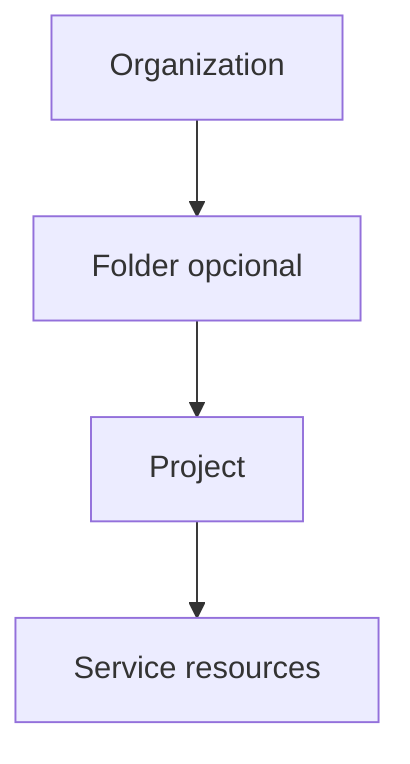
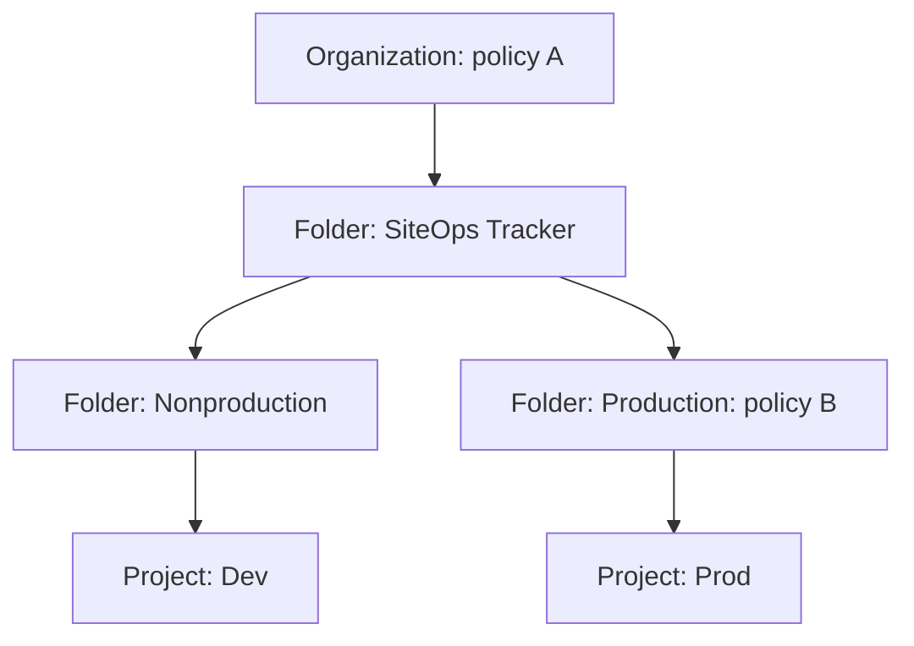
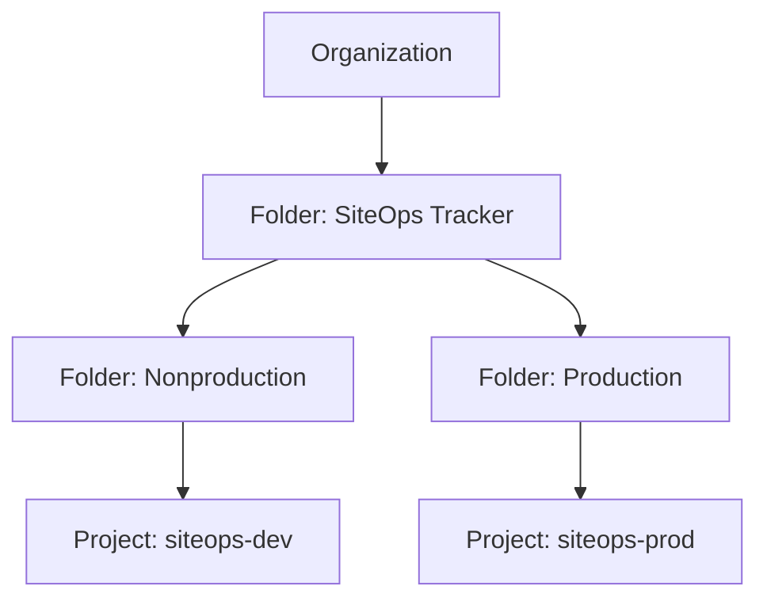
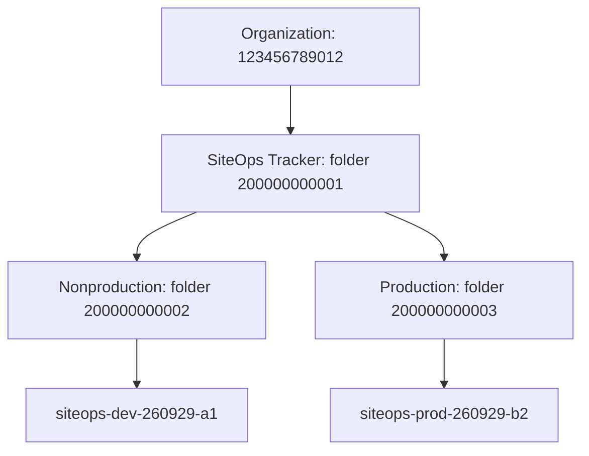

# Google Cloud Associate Cloud Engineer (ACE) 2026

## Lección 07 — Políticas de organización, restricciones y herencia

**Fecha del plan:** 29 de septiembre de 2026  
**Dominio de la guía oficial:** 1.1 — *Setting up cloud projects and accounts*  
**Punto de la guía:** *Applying organizational policies to the resource hierarchy*  
**Duración sugerida:** 75–90 minutos  
**Proyecto transversal:** **SiteOps Tracker**, proyecto ficticio de portafolio  
**Práctica del día:** decidir en qué nivel aplicar tres restricciones y observar la diferencia frente a IAM

> Hoy estudiarás **Organization Policy Service**. La administración detallada de usuarios, grupos y roles IAM corresponde a la siguiente lección. Aquí veremos IAM solo para distinguir dos preguntas: **quién puede actuar** frente a **qué configuraciones permite la organización**.

---

## 1. Objetivo de aprendizaje

Al terminar la lección podrás:

1. Explicar qué problema resuelve Organization Policy Service.
2. Distinguir **constraint**, **organization policy**, **policy rule** y **effective policy**.
3. Explicar cómo una política se hereda en Organization → Folder → Project.
4. Comparar Organization Policy con IAM sin confundir sus propósitos.
5. Elegir el nivel correcto para tres restricciones de SiteOps Tracker.
6. Inspeccionar políticas configuradas y efectivas desde Console y `gcloud`, sin modificarlas.
7. Reconocer el valor de *dry-run mode* y la importancia de comprobar si una restricción es retroactiva.
8. Resolver escenarios ACE en inglés sobre alcance, herencia y controles preventivos.

### Evidencia que debes producir

Al finalizar, conserva:

- una matriz de las tres restricciones y el nivel elegido;
- una explicación de por qué descartaste los otros niveles;
- una comparación Organization Policy vs IAM;
- la salida redactada de consultas de solo lectura, o la alternativa conceptual;
- tu puntuación en 10 preguntas;
- una ficha de errores y fechas de recuperación.

Recibir este archivo no demuestra dominio. Debes completar la práctica y explicar las decisiones sin leer.

---

## 2. Prerrequisitos explicados desde cero

### 2.1 Jerarquía de recursos

Recuerda la estructura de la Lección 06:



La posición de una política importa porque los descendientes heredan controles de sus ancestros.

### 2.2 Cuenta y configuración activas

`gcloud` opera con una cuenta y una configuración activas. Antes de interpretar una política, confirma que consultas el proyecto y la identidad correctos.

### 2.3 Acceso de solo lectura

Para ver políticas necesitas permisos de lectura, normalmente incluidos en **Organization Policy Viewer** (`roles/orgpolicy.policyViewer`) sobre el recurso apropiado. Para crear o modificar políticas se requiere **Organization Policy Administrator** (`roles/orgpolicy.policyAdmin`).

La práctica de hoy no requiere el rol administrador y no justifica pedir permisos amplios.

### 2.4 Alternativa sin organización

Una cuenta personal puede no mostrar una Organization resource ni folders. Eso no impide aprender el tema: la sección 14 incluye un entorno ficticio completo y resultados esperados.

---

## 3. Analogía: credencial de acceso frente a reglamento del edificio

Imagina un edificio corporativo:

- **IAM** es la credencial de acceso: determina quién puede entrar y qué puertas puede abrir.
- **Organization Policy** es el reglamento técnico: prohíbe, por ejemplo, instalar cierto tipo de cerradura o conectar un equipo no autorizado.

Una persona puede tener credencial para administrar una sala y aun así no poder instalar un dispositivo prohibido por el reglamento.

En Google Cloud:

- IAM pregunta: **Who can do what on which resource?**
- Organization Policy pregunta: **What configurations or actions are allowed within this scope?**

Ejemplo:

> Una persona tiene un rol IAM que incluye permisos para actualizar Cloud SQL. Si una Organization Policy efectiva restringe la IP pública, ese permiso IAM no anula la restricción. La actualización incompatible se rechaza.

---

## 4. Componentes de Organization Policy

### 4.1 Constraint

Una **constraint** define un tipo de restricción que un servicio de Google Cloud sabe evaluar.

Ejemplos vigentes usados en esta lección:

| Propósito | Nombre completo de la constraint |
|---|---|
| Bloquear nuevas claves de service accounts | `constraints/iam.managed.disableServiceAccountKeyCreation` |
| Exigir OS Login | `constraints/compute.managed.requireOsLogin` |
| Restringir IP pública de Cloud SQL | `constraints/sql.managed.restrictPublicIp` |

La constraint define la capacidad de control; por sí sola no expresa necesariamente qué configuración has aplicado a un recurso concreto.

### 4.2 Organization policy

Una **organization policy** es la configuración de una constraint en un nodo de la jerarquía.

Ejemplo conceptual:

```text
Constraint: constraints/sql.managed.restrictPublicIp
Attached resource: Production folder
Mode: active
Configured behavior: enforced
```

Cada organization policy aplica una sola constraint, en modo activo, *dry-run* o ambos, según lo que admita la plataforma y la configuración.

### 4.3 Policy rule

Una **policy rule** expresa el comportamiento que debe evaluarse. Según el tipo de constraint, una regla puede:

- activar o desactivar una restricción booleana;
- permitir o denegar valores de una lista;
- usar parámetros definidos por una managed constraint;
- incluir condiciones basadas en tags, cuando la constraint lo permite.

### 4.4 Effective policy

La **effective policy** es el resultado final que recibe un recurso después de evaluar:

- la política configurada directamente en ese recurso;
- las políticas de sus ancestros;
- las reglas de herencia, reemplazo o combinación del tipo de constraint;
- el comportamiento predeterminado administrado por Google cuando no hay una configuración aplicable.

Para el examen y para operación real, importa la política efectiva, no solo la política visible en el proyecto.

---

## 5. Tipos de constraints

### 5.1 Managed constraints

Son restricciones predefinidas por Google en la plataforma moderna de Organization Policy. Pueden usar parámetros booleanos o de lista definidos por el servicio que las aplica.

Ejemplos:

- `constraints/iam.managed.disableServiceAccountKeyCreation`
- `constraints/compute.managed.requireOsLogin`
- `constraints/sql.managed.restrictPublicIp`

Una managed constraint heredada no se combina automáticamente con otra configuración hija como una lista heredada clásica: el recurso hereda la configuración del padre o la sustituye con su propia política, conforme a la evaluación jerárquica.

### 5.2 Legacy managed constraints

Son constraints predefinidas del modelo anterior. Muchas siguen disponibles y pueden ser booleanas o de lista.

Ejemplos históricos que todavía aparecen en documentación:

- `constraints/compute.requireOsLogin`
- `constraints/sql.restrictPublicIp`
- `constraints/gcp.resourceLocations`

No asumas que el nombre con prefijo `.managed` y el nombre heredado son intercambiables. Consulta la referencia vigente y usa la constraint apropiada para el servicio y el entorno.

### 5.3 Custom constraints

Una **custom constraint** permite expresar una restricción compatible con un servicio mediante campos, métodos, acciones y una condición CEL.

Para ACE, la regla de decisión es:

1. busca primero una managed constraint predefinida;
2. usa una custom constraint solo cuando el requisito no está cubierto y el servicio admite ese control;
3. prueba el impacto antes de activarla.

Hoy no crearás custom constraints.

### 5.4 Boolean, list y parámetros

| Forma | Pregunta que responde | Ejemplo conceptual |
|---|---|---|
| Boolean | ¿Se aplica o no la restricción? | impedir claves nuevas |
| List | ¿Qué valores se permiten o deniegan? | ubicaciones permitidas |
| Managed parameters | ¿Qué valores definidos por el servicio configuran la restricción? | opciones de una managed constraint |

No memorices solo “boolean vs list”. Lee la descripción de cada constraint: allí se indica el comportamiento, valores válidos, alcance, compatibilidad con *dry-run* y retroactividad.

---

## 6. Herencia y evaluación jerárquica

### 6.1 Herencia por defecto

Cuando configuras una organization policy en un recurso, sus descendientes la heredan por defecto.



En el diagrama:

- Dev hereda la política A desde Organization.
- Prod hereda la política A y recibe también la política B desde Production.
- La política efectiva depende de qué constraint configura A o B y de sus reglas de evaluación.

### 6.2 Política configurada frente a política efectiva

Una consulta sin `--effective` intenta mostrar la política adjunta directamente al nodo consultado. Una consulta con `--effective` muestra el resultado final aplicable después de la jerarquía.

Un proyecto puede no tener una política configurada localmente y, aun así, estar restringido por una política heredada.

### 6.3 Reemplazo, combinación y precedencia

No existe una única regla de combinación válida para todas las constraints:

- las managed constraints heredadas se aplican como fueron configuradas en el padre, salvo que una política hija las sustituya;
- ciertas legacy list constraints pueden combinar valores cuando se habilita herencia;
- en conflictos de listas heredadas, valores denegados pueden tener precedencia;
- una configuración puede dejar de heredar o restaurar el comportamiento predeterminado, según el modelo y la constraint.

Regla segura para ACE:

> No adivines el resultado por el nombre de la folder. Consulta la **effective policy** de la constraint en el recurso objetivo.

### 6.4 Comportamiento predeterminado

Si ninguna política aplicable aparece en la ruta de ancestros, se usa el comportamiento predeterminado que Google define para esa constraint. “No configurada” no significa universalmente “denegada” ni “permitida”; debes leer la descripción.

### 6.5 Las políticas nuevas no suelen corregir el pasado

Organization Policy impide operaciones incompatibles cuando el servicio evalúa la constraint. Muchas restricciones no son retroactivas.

Ejemplos de esta lección:

- bloquear creación de claves impide claves nuevas, pero exige revisar por separado las ya existentes;
- restringir IP pública de Cloud SQL no elimina automáticamente IP pública de instancias existentes;
- exigir OS Login tiene comportamiento documentado distinto para proyectos nuevos y existentes.

Siempre confirma la retroactividad en la referencia de la constraint.

---

## 7. Active mode y dry-run mode

### 7.1 Active mode

En modo activo, el servicio aplica la constraint y rechaza operaciones que la violan.

### 7.2 Dry-run mode

En *dry-run mode* se evalúan y registran violaciones, pero las operaciones no se deniegan por esa configuración de prueba.

Es útil para:

- detectar flujos que dejarían de funcionar;
- comprobar automatizaciones y dependencias;
- preparar comunicación y remediación;
- reducir sorpresas antes de activar una restricción.

No todas las constraints tienen idénticas capacidades. Confirma que la constraint concreta admite *dry-run* y usa la documentación oficial.

### 7.3 Secuencia de cambio recomendada

1. Identifica el requisito.
2. Selecciona la constraint oficial adecuada.
3. Define el alcance mínimo correcto.
4. Revisa configuración actual y effective policy.
5. Comprueba impacto y retroactividad.
6. Prueba en un entorno controlado o *dry-run* cuando sea compatible.
7. Corrige dependencias.
8. Activa con aprobación y plan de reversión.
9. Verifica resultados y logs.

La práctica de hoy termina en el paso 4 y en un diseño conceptual de los pasos 5–8.

---

## 8. Organization Policy frente a IAM

| Pregunta | Organization Policy | IAM |
|---|---|---|
| Propósito principal | Limitar configuraciones o acciones permitidas | Autorizar quién puede hacer qué sobre qué recurso |
| Elementos centrales | constraint, policy rule, effective policy | principal, role, permission, resource |
| Ejemplo | bloquear IP pública de Cloud SQL | conceder Cloud SQL Viewer a un grupo |
| Herencia | desde Organization/Folder/Project según evaluación de la constraint | las allow policies de ancestros contribuyen al acceso efectivo |
| ¿Un rol IAM puede anularlo? | No | No anula Organization Policy |
| Pregunta ACE típica | “Prevent all projects from…” | “Grant least privilege to…” |

### Ejemplo integrado

Ana tiene un rol IAM que incluye permiso para actualizar una instancia de Cloud SQL.

- IAM responde: Ana está autorizada para solicitar la actualización.
- Organization Policy responde: la configuración solicitada —habilitar IP pública— está prohibida en Production.
- Resultado: la operación se rechaza.

Quitar el rol a Ana cambiaría **quién puede actuar**. Modificar la constraint cambiaría **qué configuración se permite**. Son problemas distintos.

---

## 9. Cómo elegir el nivel correcto

Aplica esta secuencia:

1. Define exactamente qué recursos deben quedar restringidos.
2. Localiza su **lowest common ancestor** en la jerarquía.
3. Comprueba que no incluya recursos que necesitan un comportamiento diferente.
4. Evalúa futuras incorporaciones: ¿deben heredar automáticamente?
5. Evita duplicar la misma política proyecto por proyecto si comparten un padre adecuado.
6. No uses Organization si una folder expresa mejor el alcance.
7. No uses Project si una folder debe proteger proyectos actuales y futuros.

### Niveles y efectos

| Nivel | Úsalo cuando… | Riesgo de elegirlo mal |
|---|---|---|
| Organization | todos los descendientes deben cumplir el mismo control | alcance excesivo y ruptura de excepciones legítimas |
| Product folder | todos los entornos de una aplicación deben cumplirlo | puede incluir laboratorios que requieren otra transición |
| Environment folder | todos los proyectos de ese entorno deben cumplirlo | una nueva carpeta paralela podría quedar sin protección |
| Project | el requisito es excepcional y exclusivo de ese proyecto | duplicación, deriva y olvido de proyectos futuros |

---

## 10. Tres decisiones para SiteOps Tracker

### Arquitectura usada



### Decisión 1 — Bloquear nuevas claves persistentes de service accounts

**Constraint:** `constraints/iam.managed.disableServiceAccountKeyCreation`  
**Nivel propuesto:** Organization

Razón:

- una clave persistente exportada puede filtrarse;
- el requisito de seguridad aplica a todos los equipos y productos;
- colocarla solo en SiteOps Tracker dejaría otros proyectos sin el control;
- aplicarla proyecto por proyecto produciría deriva.

Alternativas preferidas para cargas:

- identidad adjunta al recurso;
- service account impersonation;
- credenciales de corta duración;
- Workload Identity Federation cuando corresponda.

Estas alternativas se estudiarán con mayor detalle en el dominio de seguridad.

### Decisión 2 — Exigir OS Login en proyectos de SiteOps Tracker

**Constraint:** `constraints/compute.managed.requireOsLogin`  
**Nivel propuesto:** folder `SiteOps Tracker`

Razón:

- desarrollo y producción deben usar el mismo modelo de acceso a VM;
- los futuros proyectos bajo el producto lo heredarán;
- no es necesario imponerlo hoy a productos ajenos con una transición diferente;
- configurarlo por proyecto aumentaría la posibilidad de inconsistencias.

### Decisión 3 — Restringir IP pública de Cloud SQL en producción

**Constraint:** `constraints/sql.managed.restrictPublicIp`  
**Nivel propuesto:** folder `Production`

Razón:

- todos los proyectos de producción deben impedir nuevas configuraciones de IP pública;
- futuros proyectos productivos heredarán la restricción;
- un laboratorio no productivo podría necesitar una transición diferente y controlada;
- aplicarla solo al proyecto actual no protegería futuros proyectos de producción.

Esta constraint no es retroactiva: una instancia existente con IP pública requiere remediación aparte.

### Matriz final

| Requisito | Constraint | Nivel | Por qué no otro nivel |
|---|---|---|---|
| Sin nuevas claves persistentes | `iam.managed.disableServiceAccountKeyCreation` | Organization | Es una base de seguridad común, no exclusiva del producto. |
| OS Login para SiteOps Tracker | `compute.managed.requireOsLogin` | Product folder | Organization sería más amplio; Project duplicaría la configuración. |
| Sin IP pública de Cloud SQL en prod | `sql.managed.restrictPublicIp` | Production folder | Product folder incluiría nonprod; Project omitiría futuros proyectos. |

---

## 11. Qué herramienta elegir y qué alternativa descartar

| Requisito | Herramienta adecuada | Por qué no usar la alternativa |
|---|---|---|
| Impedir una configuración en muchos proyectos | Organization Policy | IAM autoriza identidades, pero no expresa por sí solo una restricción uniforme de configuración. |
| Dar lectura de logs a un grupo | IAM | Organization Policy no concede roles a personas. |
| Bloquear tráfico de red por origen, destino o puerto | VPC firewall / Cloud NGFW | Organization Policy puede gobernar configuraciones, pero no sustituye las reglas de filtrado de paquetes. |
| Detectar una mala configuración | Security Command Center u observabilidad apropiada | Una herramienta de detección no es automáticamente un control preventivo. |
| Impedir IP pública nueva en Cloud SQL | Organization Policy con la constraint de Cloud SQL | Una convención de nombres o una nota en documentación no impide la operación. |
| Representar un costo o propietario | labels/tags | Una nueva rama jerárquica para cada dimensión vuelve el árbol rígido. |

Regla de examen:

> **Prevent configuration** suele apuntar a Organization Policy; **grant access** suele apuntar a IAM; **filter traffic** suele apuntar a firewall.

---

## 12. Práctica guiada segura — Google Cloud Console

### 12.1 Reglas de seguridad

La práctica es de solo lectura:

- no crearás políticas;
- no cambiarás enforcement;
- no editarás herencia;
- no añadirás excepciones;
- no modificarás IAM;
- no crearás ni eliminarás recursos.

No publiques IDs, correos, principals, bindings ni salidas completas de una organización real.

### 12.2 Abre Organization policies

1. Entra a [Google Cloud Console](https://console.cloud.google.com/).
2. Confirma la cuenta activa.
3. Busca **IAM & Admin → Organization Policies**.
4. En el selector de recursos, elige únicamente una organización, folder o proyecto que tengas autorizado inspeccionar.
5. Si no tienes Organization resource o permiso de lectura, pasa directamente a la alternativa conceptual.

### 12.3 Inspecciona las tres constraints

Busca una por una:

- `Disable service account key creation`;
- `Require OS Login`;
- `Restrict Public IP access on Cloud SQL instances`.

Los nombres visibles pueden aparecer junto al identificador de constraint. Registra:

| Campo | Qué observar |
|---|---|
| Constraint ID | identificador exacto |
| Type | managed, legacy managed o custom |
| Default behavior | comportamiento si no hay política aplicable |
| Policy source | recurso donde se configuró |
| Effective policy | resultado aplicable en el recurso elegido |
| Active / dry-run | modo observado, si aparece |
| Retroactive | sí, no o “consultar documentación” |

No pulses **Manage policy**, **Edit**, **Set policy** ni **Delete**.

### 12.4 Compara un nodo y un descendiente

Si tienes visibilidad:

1. selecciona la folder `Production` o una folder de laboratorio equivalente;
2. observa la policy source y effective policy de una constraint;
3. cambia el selector al proyecto descendiente;
4. observa si el proyecto muestra la política como heredada;
5. redacta datos reales antes de guardar evidencia.

### 12.5 Observa IAM sin modificarlo

En el proyecto autorizado:

1. abre **IAM & Admin → IAM**;
2. identifica que la vista se organiza alrededor de principals y roles;
3. vuelve a **Organization Policies**;
4. explica en una frase qué pregunta responde cada pantalla.

No copies correos ni nombres de grupos en material público.

---

## 13. Práctica guiada segura — Cloud Shell y gcloud

Los comandos siguientes se comprobaron con la referencia oficial vigente el 29 de septiembre de 2026. Son consultas de solo lectura.

### 13.1 Confirma identidad y configuración

```bash
gcloud auth list
gcloud config list
```

### 13.2 Define marcadores autorizados

Reemplaza únicamente con recursos que estés autorizado a consultar:

```bash
ORG_ID="REEMPLAZA_CON_ORGANIZATION_ID"
SITEOPS_FOLDER_ID="REEMPLAZA_CON_FOLDER_ID"
PROD_FOLDER_ID="REEMPLAZA_CON_FOLDER_ID"
PROD_PROJECT_ID="REEMPLAZA_CON_PROJECT_ID"
```

No ejecutes comandos con los marcadores sin reemplazar.

### 13.3 Lista políticas configuradas en un recurso

Para una organización:

```bash
gcloud org-policies list \
  --organization="$ORG_ID"
```

Para un proyecto:

```bash
gcloud org-policies list \
  --project="$PROD_PROJECT_ID"
```

Para incluir constraints disponibles que no tienen una política configurada directamente:

```bash
gcloud org-policies list \
  --project="$PROD_PROJECT_ID" \
  --show-unset
```

`--show-unset` puede producir una salida larga. No la publiques sin revisar y redactar.

### 13.4 Consulta políticas efectivas

En los argumentos de CLI se usa el nombre de la constraint sin el prefijo `constraints/`, siguiendo la referencia de `gcloud org-policies describe`.

```bash
gcloud org-policies describe \
  iam.managed.disableServiceAccountKeyCreation \
  --project="$PROD_PROJECT_ID" \
  --effective
```

```bash
gcloud org-policies describe \
  compute.managed.requireOsLogin \
  --project="$PROD_PROJECT_ID" \
  --effective
```

```bash
gcloud org-policies describe \
  sql.managed.restrictPublicIp \
  --project="$PROD_PROJECT_ID" \
  --effective
```

El flag `--effective` es esencial para ver el resultado aplicable después de la herencia.

### 13.5 Compara política directa y efectiva

Consulta la política adjunta directamente a Production:

```bash
gcloud org-policies describe \
  sql.managed.restrictPublicIp \
  --folder="$PROD_FOLDER_ID"
```

Después consulta la efectiva en el proyecto descendiente:

```bash
gcloud org-policies describe \
  sql.managed.restrictPublicIp \
  --project="$PROD_PROJECT_ID" \
  --effective
```

Si no existe una política directa en la folder, el primer comando puede indicar que no se encontró. Eso no demuestra que el proyecto carezca de una effective policy procedente de otro ancestro o del comportamiento predeterminado.

### 13.6 Observa IAM por separado

```bash
gcloud projects get-iam-policy "$PROD_PROJECT_ID"
```

La salida contiene principals y roles. Revísala en privado y no la publiques sin redactar identidades.

Completa esta comparación:

| Consulta | Datos principales | Pregunta que responde |
|---|---|---|
| `gcloud org-policies describe ... --effective` | constraint y reglas efectivas | ¿Qué configuración está permitida o restringida? |
| `gcloud projects get-iam-policy` | principals, roles y bindings | ¿Quién tiene qué acceso al proyecto? |

### 13.7 Limpia variables locales

```bash
unset ORG_ID
unset SITEOPS_FOLDER_ID
unset PROD_FOLDER_ID
unset PROD_PROJECT_ID
```

---

## 14. Alternativa conceptual completa sin cuenta o permisos

### 14.1 Jerarquía ficticia



Todos los identificadores son ficticios.

### 14.2 Políticas configuradas

| Nodo | Constraint | Configuración conceptual |
|---|---|---|
| Organization | `iam.managed.disableServiceAccountKeyCreation` | enforced |
| SiteOps Tracker folder | `compute.managed.requireOsLogin` | enforced |
| Production folder | `sql.managed.restrictPublicIp` | enforced |

### 14.3 Calcula políticas efectivas

Sin mirar la solución, completa:

| Proyecto | Sin nuevas claves | OS Login requerido | Cloud SQL sin IP pública |
|---|---|---|---|
| Development |  |  |  |
| Production |  |  |  |

### 14.4 Solución

| Proyecto | Sin nuevas claves | OS Login requerido | Cloud SQL sin IP pública |
|---|---|---|---|
| Development | Sí, heredada de Organization | Sí, heredada de SiteOps Tracker | No por la policy de Production; revisar default u otras policies |
| Production | Sí, heredada de Organization | Sí, heredada de SiteOps Tracker | Sí, heredada de Production |

### 14.5 Contraste con IAM

Supón que una persona tiene un rol que permite actualizar Cloud SQL en Production.

Responde:

1. ¿IAM le permite solicitar la actualización? Depende de los permisos exactos del rol, pero el escenario dice que sí.
2. ¿Puede habilitar IP pública? No, si la effective Organization Policy lo restringe.
3. ¿Qué control tendrías que cambiar para permitir esa configuración? La Organization Policy, no el rol IAM.
4. ¿Deberías cambiarla sin análisis? No; primero revisa requisito, riesgo, impacto, aprobación y alternativas.

---

## 15. Hoja de decisión de la práctica

Completa sin copiar la propuesta:

| Requisito | Recursos afectados | Constraint elegida | Nivel elegido | Ancestro común más bajo | Alternativas descartadas | Riesgo de alcance excesivo | Retroactividad |
|---|---|---|---|---|---|---|---|
| Sin nuevas claves |  |  |  |  |  |  |  |
| OS Login |  |  |  |  |  |  |  |
| Cloud SQL sin IP pública |  |  |  |  |  |  |  |

### Tres explicaciones obligatorias

Escribe de 2 a 4 frases para cada una:

1. Por qué la restricción de claves pertenece a Organization.
2. Por qué OS Login pertenece a la folder del producto.
3. Por qué la restricción de Cloud SQL pertenece a Production.

### Explicación en inglés

Completa y di en voz alta:

> I would apply `__________` at the `__________` level because `__________`. I would not apply it at the `__________` level because `__________`.

---

## 16. Resultado esperado

- [ ] Puedo definir constraint, organization policy y effective policy.
- [ ] Distingo política directa de política efectiva.
- [ ] Explico la herencia por la jerarquía.
- [ ] No asumo que todas las constraints combinan igual.
- [ ] Distingo Organization Policy de IAM.
- [ ] Elegí un nivel para cada una de las tres restricciones.
- [ ] Justifiqué por qué descarté Organization, Folder o Project en cada caso.
- [ ] Inspeccioné políticas de solo lectura o completé la alternativa conceptual.
- [ ] No edité políticas ni bindings IAM.
- [ ] Registré retroactividad y *dry-run* como verificaciones obligatorias.

---

## 17. Solución de problemas

### Caso 1 — No aparece una Organization resource

La cuenta puede ser personal o no tener visibilidad. No intentes crear una organización para completar esta práctica. Usa la alternativa conceptual.

### Caso 2 — `PERMISSION_DENIED`

Posibles causas:

- cuenta activa incorrecta;
- falta de `orgpolicy.policy.get` u otros permisos de lectura;
- recurso fuera de tu alcance autorizado.

Acciones:

```bash
gcloud auth list
gcloud config list
```

Solicita, si corresponde, acceso de solo lectura mediante el proceso de tu organización. No pidas `roles/orgpolicy.policyAdmin` para una práctica de consulta.

### Caso 3 — La política directa no existe, pero la acción sigue bloqueada

Consulta la effective policy:

```bash
gcloud org-policies describe \
  sql.managed.restrictPublicIp \
  --project="PROJECT_ID" \
  --effective
```

La restricción puede provenir de una folder o de Organization.

### Caso 4 — La policy source no es el proyecto

Es el comportamiento esperado cuando una política se hereda. Recorre Organization → folders → project y localiza el ancestro indicado.

### Caso 5 — IAM muestra un rol suficiente, pero la operación se rechaza

Un rol autorizado no anula Organization Policy. Lee el mensaje de error y revisa la effective policy de la constraint relacionada.

### Caso 6 — Se activó una restricción, pero un recurso existente continúa igual

Comprueba la documentación de retroactividad. Muchas constraints bloquean creación o actualización futura y no remedian automáticamente recursos existentes.

### Caso 7 — Confusión entre constraint ID completo y argumento de CLI

En documentación verás:

```text
constraints/sql.managed.restrictPublicIp
```

En `gcloud org-policies describe`, la referencia vigente usa:

```text
sql.managed.restrictPublicIp
```

No inventes ni mezcles nombres de legacy y managed constraints.

### Caso 8 — `--show-unset` devuelve demasiada información

Usa `describe` con una constraint específica. Para el laboratorio solo necesitas las tres de SiteOps Tracker.

---

## 18. Impacto en costos y limpieza

### Costos

La práctica principal:

- usa consultas de configuración;
- no crea recursos de aplicación;
- no cambia políticas;
- no despliega VMs, Cloud SQL, buckets ni servicios.

Por tanto, no debería generar consumo de esos recursos. Aun así, usa proyectos de laboratorio autorizados y revisa las condiciones del entorno.

Una organization policy puede influir indirectamente en costos al:

- impedir arquitecturas no aprobadas;
- obligar a usar configuraciones compatibles;
- provocar trabajo de remediación si se aplica sin evaluación;
- bloquear despliegues automatizados que deberán corregirse.

No elijas una policy únicamente por costo: primero identifica el requisito de gobierno o seguridad.

### Limpieza

No hay recursos de Google Cloud que eliminar. Solo borra variables locales con los comandos de la sección 13.7 y cierra Cloud Shell cuando termines.

---

## 19. Glosario bilingüe

| English | Español | Significado práctico |
|---|---|---|
| Organization Policy Service | Servicio de políticas de organización | Control centralizado de restricciones |
| organization policy | política de organización | Configuración de una constraint en un recurso |
| constraint | restricción | Tipo de comportamiento que un servicio puede limitar |
| managed constraint | restricción administrada | Constraint predefinida por Google en la plataforma moderna |
| legacy managed constraint | restricción administrada heredada | Constraint predefinida del modelo anterior |
| custom constraint | restricción personalizada | Control definido por la organización para un servicio compatible |
| policy rule | regla de política | Comportamiento configurado dentro de una policy |
| effective policy | política efectiva | Resultado final tras jerarquía y reglas de evaluación |
| policy source | origen de política | Nodo donde se configuró la policy |
| inheritance | herencia | Aplicación descendente desde un ancestro |
| override | sustitución | Configuración hija que reemplaza una heredada según las reglas |
| merge | combinación | Unión de valores cuando el tipo de constraint lo admite |
| default behavior | comportamiento predeterminado | Resultado administrado por Google si no hay policy aplicable |
| enforcement | aplicación obligatoria | Rechazo de operaciones incompatibles |
| active mode | modo activo | Evalúa y bloquea violaciones |
| dry-run mode | modo de prueba | Registra violaciones sin bloquear por esa configuración |
| retroactive | retroactivo | Que afecta recursos o estados ya existentes |
| principal | principal | Identidad humana o de workload en IAM |
| role | rol | Conjunto de permisos IAM |
| least privilege | mínimo privilegio | Solo los permisos necesarios |
| lowest common ancestor | ancestro común más bajo | Nodo inferior que contiene exactamente el alcance deseado |

### Frases para el examen

- **The project inherits the organization policy from its parent folder.**  
  El proyecto hereda la política de organización de su folder padre.

- **IAM grants access; Organization Policy restricts allowed configurations.**  
  IAM concede acceso; Organization Policy restringe configuraciones permitidas.

- **Check the effective policy before changing the child resource.**  
  Comprueba la política efectiva antes de cambiar el recurso hijo.

- **The constraint is not retroactive.**  
  La restricción no es retroactiva.

- **Use dry-run mode to evaluate impact before enforcement.**  
  Usa el modo de prueba para evaluar el impacto antes de la aplicación obligatoria.

---

## 20. Preguntas originales estilo ACE — en inglés

Tiempo sugerido: **18 minutos**. No consultes las soluciones antes de terminar.

### Question 1

An organization wants to prevent the creation of new persistent service account keys in every current and future project. Where should the cloud engineer apply the relevant organization policy?

A. On each service account individually  
B. At the organization resource  
C. On the billing account  
D. In each application's source code

### Question 2

SiteOps Tracker has separate Development and Production folders. The company must prevent public IP configuration on Cloud SQL only for all current and future production projects. What is the best scope?

A. The Organization resource  
B. The SiteOps Tracker product folder  
C. The Production folder  
D. The current production project only

### Question 3

A developer has an IAM role that includes permission to update Cloud SQL instances. An effective organization policy restricts public IP on the target project. What happens when the developer tries to enable public IP?

A. IAM always takes precedence, so the update succeeds.  
B. The request is denied by the organization policy.  
C. The billing account decides whether it succeeds.  
D. The project automatically removes the IAM role.

### Question 4

What does an **effective organization policy** represent?

A. Only the policy configured directly on the project  
B. The final applicable result after hierarchy evaluation and default behavior  
C. A list of IAM principals who can edit the resource  
D. The monthly cost of enforcing the constraint

### Question 5 — Select two

Which two statements about dry-run mode are correct?

A. It can help identify policy violations before active enforcement.  
B. It grants the Organization Policy Administrator role temporarily.  
C. Violating actions are not denied by the dry-run configuration itself.  
D. It guarantees that every constraint is retroactive.  
E. It replaces the need to review service documentation.

### Question 6

A project has no organization policy configured directly on it, but an operation is denied by a constraint. What should the engineer check first?

A. The effective policy and the project's ancestors  
B. The Cloud Billing budget  
C. The VM's operating system password  
D. The project's display name

### Question 7

Which command retrieves the effective policy for the managed Cloud SQL public IP constraint on project `siteops-prod-example`?

A. `gcloud projects get-iam-policy siteops-prod-example --effective`  
B. `gcloud org-policies describe sql.managed.restrictPublicIp --project=siteops-prod-example --effective`  
C. `gcloud compute firewall-rules list --project=siteops-prod-example`  
D. `gcloud billing projects describe siteops-prod-example`

### Question 8

The team wants all SiteOps Tracker projects, but no unrelated products, to require OS Login. Where should the policy be applied?

A. At the SiteOps Tracker folder  
B. At the billing account  
C. On one VM instance  
D. At the Organization resource regardless of scope

### Question 9

After a Cloud SQL public IP restriction is enforced, an existing instance still has a public IP. What is the best explanation?

A. Organization Policy never works with Cloud SQL.  
B. The constraint is not retroactive, so the existing instance requires separate remediation.  
C. IAM automatically overrides all inherited constraints.  
D. The project must be moved to a billing account.

### Question 10

Which statement best distinguishes IAM from Organization Policy?

A. IAM controls regions, while Organization Policy controls billing.  
B. IAM controls who can do what on which resource; Organization Policy restricts what configurations or actions are allowed in a scope.  
C. IAM applies only to users, while Organization Policy applies only to VMs.  
D. They are two names for the same policy system.

---

## 21. Soluciones justificadas

### Answer 1 — B

**Why B is correct:** Organization is the common ancestor of all current and future projects, so a baseline restriction can be inherited consistently.

**Why the distractors are wrong:**

- **A:** Organization Policy attaches to hierarchy resources, not separately to every service account for this requirement.
- **C:** a billing account is not a Resource Manager ancestor or Organization Policy scope.
- **D:** application validation is useful defense in depth but cannot centrally prevent key creation across Google Cloud projects.

### Answer 2 — C

**Why C is correct:** Production is the lowest common ancestor containing exactly the projects that require the restriction.

**Why the distractors are wrong:**

- **A:** Organization would also affect unrelated projects and nonproduction.
- **B:** the product folder would include Development.
- **D:** the current project would not automatically protect future production projects.

### Answer 3 — B

**Why B is correct:** IAM authorization does not override an effective Organization Policy restriction.

**Why the distractors are wrong:**

- **A:** having permission to request an action does not make a prohibited configuration valid.
- **C:** billing pays for usage; it does not decide this configuration rule.
- **D:** policy enforcement rejects the operation; it does not automatically remove the developer's IAM role.

### Answer 4 — B

**Why B is correct:** the effective policy is the applicable result after evaluating policies on the resource and its ancestors plus the constraint's evaluation/default rules.

**Why the distractors are wrong:**

- **A:** this describes only a directly attached policy.
- **C:** principals and roles belong to IAM allow policies.
- **D:** effective policy is a governance result, not a cost report.

### Answer 5 — A and C

**Why A is correct:** dry-run helps reveal potential violations before enforcement.  
**Why C is correct:** dry-run records violations without denying the action because of that test configuration.

**Why the distractors are wrong:**

- **B:** dry-run does not grant IAM roles.
- **D:** retroactivity is constraint-specific and unrelated to dry-run.
- **E:** documentation is still required to understand support and behavior.

### Answer 6 — A

**Why A is correct:** a policy can be inherited from a folder or Organization even when nothing is set directly on the project.

**Why the distractors are wrong:**

- **B:** budgets monitor cost and do not explain an org policy denial.
- **C:** an OS password is unrelated to hierarchy evaluation.
- **D:** display names do not control policy inheritance.

### Answer 7 — B

**Why B is correct:** it uses the verified `gcloud org-policies describe` syntax, the managed constraint name, the project scope and `--effective`.

**Why the distractors are wrong:**

- **A:** `get-iam-policy` returns IAM bindings and does not accept this use of `--effective`.
- **C:** firewall rules do not report Cloud SQL Organization Policy.
- **D:** billing status is not the effective configuration constraint.

### Answer 8 — A

**Why A is correct:** the product folder is the lowest common ancestor for all SiteOps Tracker projects without including unrelated products.

**Why the distractors are wrong:**

- **B:** billing accounts are not policy ancestors.
- **C:** an instance-level setting would not govern current and future projects.
- **D:** Organization has excessive scope for the stated requirement.

### Answer 9 — B

**Why B is correct:** the managed Cloud SQL public IP constraint is documented as non-retroactive; existing public IP configuration needs separate remediation.

**Why the distractors are wrong:**

- **A:** Cloud SQL provides the relevant managed constraint.
- **C:** IAM does not override Organization Policy.
- **D:** changing billing linkage does not remediate the network configuration.

### Answer 10 — B

**Why B is correct:** it captures the central access-versus-configuration distinction.

**Why the distractors are wrong:**

- **A:** neither product is defined by that region/billing split.
- **C:** both can affect many resource types and principals/workloads.
- **D:** they are distinct control systems that work together.

### Registro de puntuación

| Resultado | Interpretación de estudio | Acción |
|---:|---|---|
| 9–10 | Base sólida inicial | Explica los tres scopes sin apuntes y programa el repaso. |
| 7–8 | Comprensión funcional con huecos | Revisa herencia, effective policy y distractores fallados. |
| 5–6 | Confusión relevante | Repite la alternativa conceptual y vuelve a responder mañana. |
| 0–4 | Base todavía insuficiente | Reestudia las secciones 3–10 y reconstruye la matriz. |

Es un criterio personal de estudio, no un umbral oficial del examen.

---

## 22. Repaso activo espaciado

Responde primero sin notas.

### D-1 hábil — Lección 06: jerarquía

1. Enumera Organization → Folder → Project → Service resource.
2. ¿Cuál nivel es opcional?
3. ¿Por qué Development y Production usan proyectos separados?
4. ¿Qué es el lowest common ancestor?
5. Explica por qué una billing account no es padre de un proyecto.

### Días hábiles anteriores — Lecciones 03 a 05

1. **Costos:** ¿por qué un presupuesto alerta pero no debe tratarse como un interruptor de gasto?
2. **Disponibilidad:** diferencia región, zona y jerarquía administrativa.
3. **Método ACE:** identifica requisito, alcance y palabra decisiva antes de elegir un producto.
4. Integra: ¿cómo puede una policy de ubicación afectar una decisión regional sin convertir la región en un nodo jerárquico?

### D-7 — Lección 02: Console, Cloud Shell y gcloud

1. ¿Qué comando muestra cuentas autenticadas?
2. ¿Qué comando muestra la configuración activa?
3. ¿Por qué debes verificar cuenta y project antes de interpretar una policy?
4. Clasifica estos comandos como lectura o cambio:
   - `gcloud auth list`
   - `gcloud config list`
   - `gcloud org-policies describe ... --effective`
5. ¿Qué datos debes redactar antes de compartir una salida?

### D-21

No existía una lección de este plan el 8 de septiembre de 2026. Registra **N/A — todavía no hay material D-21**. No inventes una recuperación.

### Recuperación de 90 segundos

Sin mirar, explica:

1. constraint;
2. direct policy;
3. effective policy;
4. IAM;
5. Organization Policy;
6. dry-run;
7. retroactividad.

---

## 23. Ficha de errores

Completa una fila por cada error o respuesta dudosa.

| Campo | Tu registro |
|---|---|
| Pregunta o situación |  |
| Mi respuesta inicial |  |
| Respuesta correcta |  |
| Tipo: concepto / alcance / herencia / inglés / CLI / prisa |  |
| Palabra decisiva que omití |  |
| Ancestro correcto |  |
| Regla de decisión corregida |  |
| Explicación nueva sin apuntes |  |
| Repetición +1 día |  |
| Repetición +7 días |  |
| Repetición +21 días |  |

### Errores críticos de hoy

- [ ] Confundí constraint con organization policy.
- [ ] Miré solo la política directa y olvidé la effective policy.
- [ ] Supuse que IAM anula Organization Policy.
- [ ] Elegí Organization aunque una folder tenía el alcance exacto.
- [ ] Elegí Project y dejé fuera futuros proyectos hermanos.
- [ ] Supuse retroactividad sin leer la constraint.
- [ ] Confundí el nombre managed con el legacy managed.
- [ ] Pensé que dry-run bloquea operaciones.

---

## 24. Criterios de autoevaluación

Asigna 0, 1 o 2:

- **0:** todavía no puedo hacerlo;
- **1:** lo hago con notas;
- **2:** lo hago sin notas y lo justifico.

| Criterio | 0 | 1 | 2 |
|---|---:|---:|---:|
| Defino constraint y organization policy |  |  |  |
| Distingo policy directa de effective policy |  |  |  |
| Explico herencia y comportamiento predeterminado |  |  |  |
| Distingo IAM de Organization Policy |  |  |  |
| Elijo el ancestro común más bajo |  |  |  |
| Justifico las tres restricciones de SiteOps Tracker |  |  |  |
| Explico dry-run y retroactividad |  |  |  |
| Uso correctamente los comandos de lectura |  |  |  |
| Obtengo al menos 8/10 en escenarios |  |  |  |

**Máximo:** 18 puntos.

- **16–18:** continúa con repaso espaciado.
- **13–15:** corrige criterios con 0 o 1.
- **9–12:** repite matriz, CLI conceptual y preguntas.
- **0–8:** reconstruye el tema desde la analogía y la jerarquía.

No marques “dominado” solo porque leíste el contenido.

---

## 25. Registro de práctica

```text
Fecha:
Tiempo total:
Ruta: Console + CLI / alternativa conceptual
Cuenta activa verificada: sí / no
Recurso inspeccionado: organization / folder / project / ninguno
Políticas efectivas consultadas:
Matriz de tres restricciones terminada: sí / no
Puntuación: __ / 10
Autoevaluación: __ / 18
Mayor confusión:
Regla que recordaré:
Próximo repaso:
```

---

## 26. Resumen de decisiones para ACE

1. **Quién puede actuar:** IAM.
2. **Qué configuración se permite:** Organization Policy.
3. **Control para todos los descendientes:** aplícalo en su ancestro común correcto.
4. **Solo producción:** usa Production folder si contiene todos esos proyectos y ninguno ajeno.
5. **Proyecto sin policy directa:** todavía puede tener effective policy heredada.
6. **Antes de activar:** revisa scope, effective policy, *dry-run*, impacto y retroactividad.
7. **Rol IAM suficiente pero operación bloqueada:** busca una Organization Policy efectiva.
8. **No memorices un ID antiguo:** confirma managed vs legacy managed en la referencia vigente.
9. **No repitas en cada project:** usa una folder cuando expresa exactamente el alcance.
10. **No supongas remediación automática:** cada constraint documenta su comportamiento.

---

## 27. Documentación oficial consultada

Verificada el **29 de septiembre de 2026**:

- [Associate Cloud Engineer certification exam guide](https://cloud.google.com/learn/certification/guides/cloud-engineer)
- [Organization Policy Service documentation](https://docs.cloud.google.com/organization-policy)
- [Organization Policy overview](https://docs.cloud.google.com/organization-policy/overview)
- [Hierarchy evaluation](https://docs.cloud.google.com/organization-policy/hierarchy-evaluation)
- [Organization policy constraints](https://docs.cloud.google.com/organization-policy/reference/org-policy-constraints)
- [Apply organization policies](https://docs.cloud.google.com/organization-policy/apply-policies)
- [Create organization policies](https://docs.cloud.google.com/organization-policy/create-organization-policies)
- [Test organization policies in dry-run mode](https://docs.cloud.google.com/organization-policy/test-policies)
- [Manage Google Cloud security baseline constraints](https://docs.cloud.google.com/organization-policy/manage-baseline-constraints)
- [IAM overview](https://docs.cloud.google.com/iam/docs/overview)
- [Organization Policy Service roles and permissions](https://docs.cloud.google.com/iam/docs/roles-permissions/orgpolicy)
- [`gcloud org-policies list`](https://docs.cloud.google.com/sdk/gcloud/reference/org-policies/list)
- [`gcloud org-policies describe`](https://docs.cloud.google.com/sdk/gcloud/reference/org-policies/describe)
- [`gcloud projects get-iam-policy`](https://docs.cloud.google.com/sdk/gcloud/reference/projects/get-iam-policy)

---

## 28. Cierre

Organization Policy e IAM trabajan juntos, pero no son intercambiables. IAM determina si una identidad está autorizada; Organization Policy establece límites de configuración para el alcance seleccionado.

La frase que debes poder explicar sin notas es:

> IAM answers who can do what on which resource. Organization Policy restricts what can be configured across the resource hierarchy.

Si todavía dudas, vuelve a los tres casos de SiteOps Tracker y responde para cada uno:

1. ¿Qué se quiere impedir?
2. ¿Qué recursos deben quedar afectados?
3. ¿Cuál es su ancestro común más bajo?
4. ¿La policy debe estar activa o primero en dry-run?
5. ¿La constraint es retroactiva?
